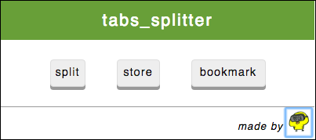
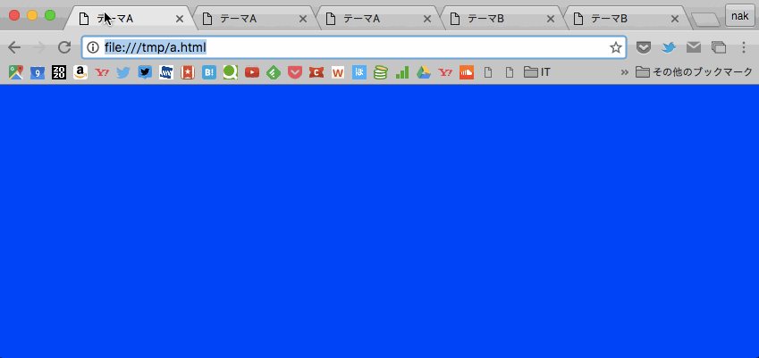
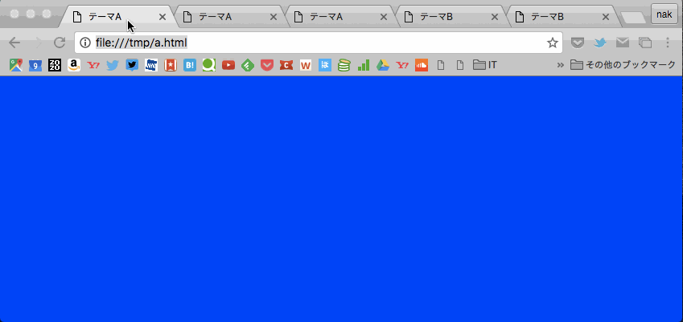
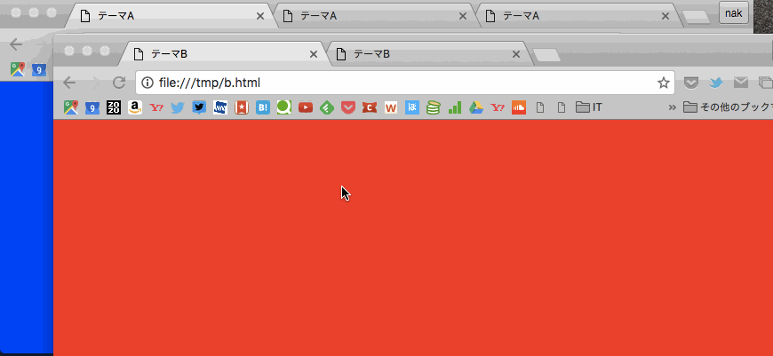
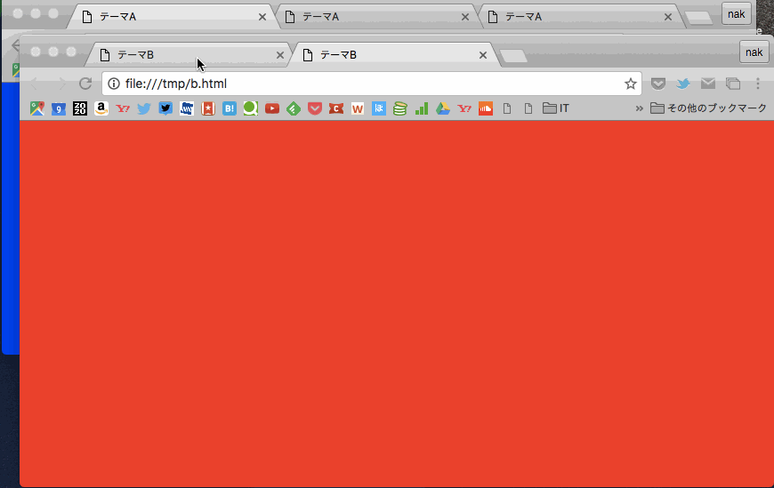

# tabs_splitter

タブ操作を少し便利にしたいChrome拡張機能

問題点
--

ウインドウ内の複数タブに対する操作は少しめんどう...。

機能
--

### `split`: 現在開いているタブを含め右側のタブを新しいウィンドウで開く

一つのウィンドウに存在する異なるテーマのタブ群を分割(split)します。

`split`ボタンを押すと、今開いている(activeな)タブを含め、そこから右側にあるタブを新しいウィンドウで開きます。

### `store`: 今開いているウィンドウをWebStorageに一時保存

保存したいタブ群をまず`split`で切り出した後に、保存したいウィンドウで`store`ボタンを押すとあなたのlocalStorageにウィンドウが保存されます。

他のデバイスで見たりするわけじゃないけど、少しの間しまっておきたい時に使います。取り出すときは、先ほどの`store`ボタンが`retrieve`ボタンになっているのでそれを押して下さい。

### `bookmark`: 今開いているウィンドウのタブを全てブックマークする

　`store`機能は使っている端末のlocalStorageに保存するので、他の端末では開くことができません。もちろんスマホのChromeでは拡張機能自体が使えないので共有できません。そんなとき今開いているウィンドウの全てのタブを一括ブックマークできるのが`bookmark`ボタンです。

　`bookmark`ボタンを押すとパスの設定画面が現れます。新しいフォルダ名とそのフォルダをどこに置くかを決めて`save`ボタンを押してください。もしフォルダ名が空であった場合、新しくフォルダは作らずそのまま展開してブックマークされます。
